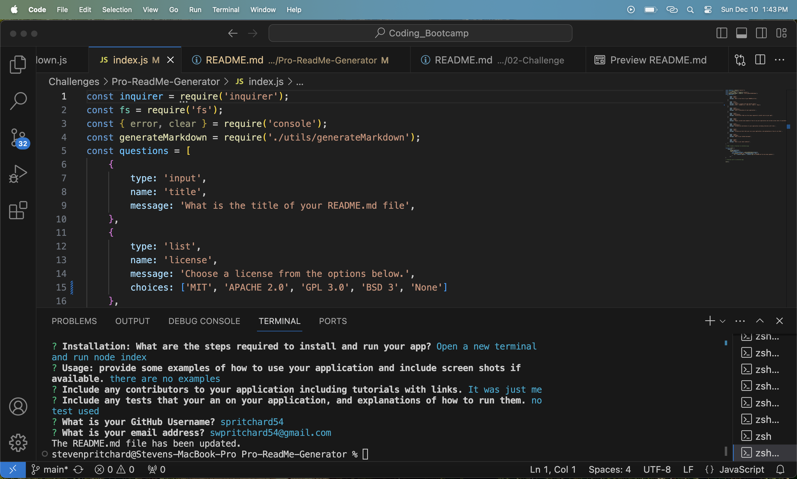

# Pro Readme 

## Table of Contents
[Installation](##Installation) 
[Option](##Option) 
[Contributing](##Contributing) 
[Tests](##Tests) 
[License Link](##license-link) 
[License Description](##license-description) 

## Description
df
    
## Installation
df
    
## Usage 
sdf
    
## Contributing 
sdf
    
## Tests
dsf

## License Link
https://opensource.org/license/mit/

## License Description
The MIT License was first developed at the Massachusetts Institute of Technology (MIT) in the late 1980s. The exact origins MIT license are bit of mystery. Like the Apache 2.0, and BSD family of licenses the MIT License is a permissive software license that places few restrictions of reuse. Users of software using an MIT License are permitted to use, copy, modify, merge publish, distribute, sublicense and sell copies of the software. Some notable projects use the MIT License including Ruby on Rails, and the X Windows System.
    
## Questions
- Github: https://github.com/spritchard54
- Email: <swpritchard54@gmail.com>